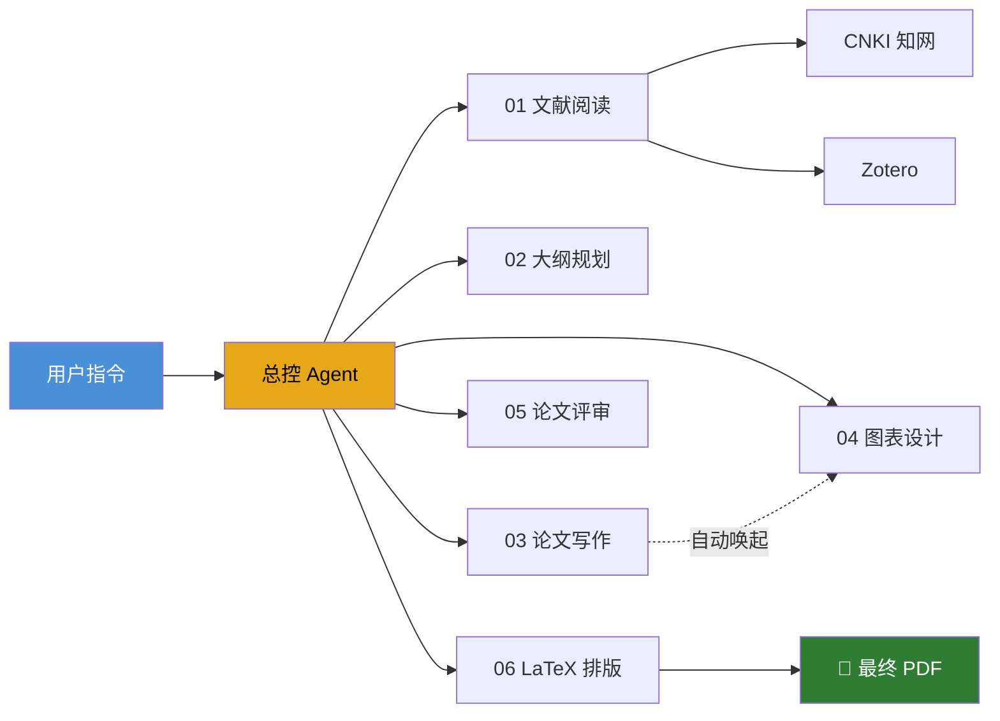
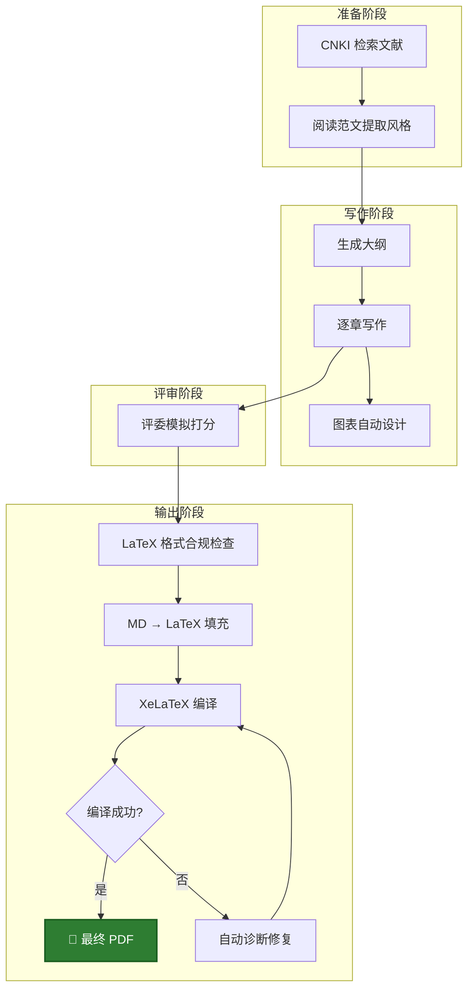

# 🎓 MCM Writer Agent（CN）

> **一键成稿，从文献到 PDF 全自动**  
> 为中国大学生数学建模竞赛（CUMCM）打造的 AI 写作智能体  
> 6 大 Skill · CNKI 知网集成 · LaTeX 自动排版 · Zotero 文献管理

<p align="center">
  
  
  
  
</p>

---

## 📖 目录

- [定位与理念](#定位与理念)
- [功能总览](#功能总览)
- [项目架构](#项目架构)
- [6 大 Skill 详解](#6-大-skill-详解)
- [环境配置](#环境配置)
- [快速开始](#快速开始)
- [完整工作流](#完整工作流)
- [PDF 转 Markdown 指南](#pdf-转-markdown-指南)
- [CNKI 知网集成](#cnki-知网集成)
- [目录结构](#目录结构)
- [常见问题](#常见问题)

---

## 定位与理念

**MCM Writer Agent (CN)** 是一套完全基于 VS Code + Markdown 的工程化数模写作辅助系统。

- 🧠 **总控 Agent 驱动**：由一个总控智能体统一调度 6 个子 Skill，用户只需一句口语化指令即可触发全流程
- 📝 **中文原生**：所有文件夹、Skill 名、指令均为中文，零学习成本
- 🔒 **数据安全**：建模结果只读不可改，杜绝 AI 幻觉篡改数据
- 📄 **端到端输出**：从文献检索 → 大纲规划 → 分章节写作 → 图表设计 → 评委模拟 → LaTeX 排版 → 最终 PDF，全链路覆盖

---

## 功能总览



| 能力 | 说明 |
|------|------|
| 📚 文献检索 | CNKI 知网批量检索 + PDF 下载 + Zotero 自动导入 |
| 🏗️ 大纲规划 | 结合范文模板 + 建模思路，自动生成论文骨架 |
| ✍️ 分章写作 | 严格依据建模数据，LaTeX 公式 + 学术风格 |
| 📊 图表设计 | 科研顶刊撞色风格，自动匹配图表类型 |
| 🔍 论文评审 | 双模式：格式质检 + 国赛评委模拟打分 |
| 📄 LaTeX 排版 | 模板填充 → 格式合规检查 → XeLaTeX 编译 → 自动修复 |

---

## 项目架构

```
MCM Writer Agent 总控
│
├── 知识库/（范文 + 评分细则 + 图表模板 + 评委记忆）
├── 技能核心库/（01-06 共 6 个 SKILL.md）
├── 赛题01/（独立隔离，含建模/编程/论文/LaTeX）
└── .github/agents/（总控 Agent 定义）
```

**核心设计原则**：
- 🗂️ **赛题隔离**：每道题（赛题01/02...）完全独立，互不干扰
- 📋 **进度可追溯**：每个赛题有独立的`进度日志.md`，记录每次操作
- 🔧 **Skill 热插拔**：每个 Skill 是独立的 `.md` 文件，可单独更新
- 🚦 **路由表驱动**：总控 Agent 通过关键词匹配自动路由到对应 Skill

---

## 6 大 Skill 详解

### 01-文献阅读与整理 📚

| 项目 | 说明 |
|------|------|
| **触发词** | "学习范文"、"提取风格" |
| **输入** | 范文存档（A/B/C 题 Markdown） |
| **输出** | 范文模板更新 + 索引清单 |
| **核心能力** | 提取论文题目、摘要关键词、架构逻辑、高频动词、图表风格、专业句式 |

### 02-论文大纲规划 🏗️

| 项目 | 说明 |
|------|------|
| **触发词** | "生成大纲"、"规划结构" |
| **输入** | 建模思路文档 + 范文模板 |
| **输出** | `论文大纲_草稿.md` |
| **核心能力** | 自动规划章节编号、子标题、预计篇幅，结合范文风格 |

### 03-论文写作 ✍️

| 项目 | 说明 |
|------|------|
| **触发词** | "写第X问"、"撰写XX部分" |
| **输入** | 建模文档 + 编程计算结果 + 范文模板 |
| **输出** | `分章节/` 下的 Markdown 草稿 |
| **核心能力** | 数据严格来自编程结果（不编造），公式 LaTeX 语法，变量符号与建模一致，自动唤起 04-图表设计 |

### 04-图表设计 📊

| 项目 | 说明 |
|------|------|
| **触发词** | "配什么图"、"设计图表" |
| **输入** | 即将撰写的文本内容 + 图表配色模板 |
| **输出** | 图表设计方案（类型/坐标轴/图例/引用语句） |
| **核心能力** | 科研顶刊撞色风格，支持折线/柱状/热力图/流程图，可被 03 自动唤起 |

### 05-论文评审 🔍

| 项目 | 说明 |
|------|------|
| **触发词** | "检查初稿"、"模拟评委打分" |
| **输入** | 论文草稿 + 国赛评分细则 + 历史评审意见 |
| **输出** | 格式质检报告 + 评委模拟评分 |
| **核心能力** | 双模式：格式质检（公式/图表编号连续性）+ 评委模式（预估国赛名次 + 改进方向） |

### 06-LaTeX 模板填充与排版 📄 🆕

| 项目 | 说明 |
|------|------|
| **触发词** | "填充LaTeX"、"生成PDF"、"修复LaTeX语法" |
| **输入** | LaTeX 模板（.cls）+ 论文草稿章节 + 格式要求 |
| **输出** | 编译后的 PDF + 格式检查报告 |
| **核心能力** | 三模式：A-填充（MD→LaTeX 转换 + 编译 + 自动修复） / B-检查（格式合规审查） / C-修复（.log 诊断 11 种常见错误） |

**工作流程**：
```
论文草稿 → 读取 LaTeX 模板 → 格式合规检查（12项）
→ MD→LaTeX 章节映射转换 → XeLaTeX 编译
→ 编译失败？→ 自动读取 .log → 诊断修复（最多3轮）→ 重新编译
→ ✅ 输出 PDF
```

---

## 环境配置

> 💡 **Agent 可自动配置**：启动后 Agent 会自动检测缺失的组件，并通过 `winget` / `pip` 命令行一键安装，无需手动下载。你只需说"配置环境"即可。

### 自动配置项

| 组件 | Agent 自动安装命令 |
|------|-------------------|
| Python 包（matplotlib/Pillow/graphviz） | `pip install ...` |
| TeX Live（XeLaTeX） | `winget install TeXLive.TeXLive --silent` |
| Graphviz（dot.exe） | `winget install Graphviz.Graphviz --silent` |

### 需手动安装

| 组件 | 用途 | 说明 |
|------|------|------|
| **VS Code** | 主编辑器 | 一次性安装 |
| **Zotero** | 文献管理（可选） | 安装后配 API Key 即可自动导入 |

### LaTeX 中文字体（CUMCM 官方模板要求）

- **SimSun**（宋体）- 正文
- **SimHei**（黑体）- 标题
- **SimKai**（楷体）- 摘要

Windows 系统自带以上字体，无需额外安装。

---

## 快速开始

### 1. 克隆项目

```bash
git clone <your-repo-url>
cd "MCM agent"
```

### 2. 在 VS Code 中打开，让 Agent 自动配置环境

用 VS Code 打开项目根目录，总控 Agent 自动加载并执行环境自检，缺失组件会通过命令行自动安装。

### 3. 放入你自己的资料（手动）

Agent 提供写作流水线，但以下内容需要你**自行放入对应文件夹**：

| 你需要放的 | 放到哪里 | 说明 |
|-----------|---------|------|
| 📄 范文 PDF | 先转 MD → `知识库/文献库/范文存档/A题/`（或B题/C题） | 供 01-Skill 学习风格 |
| 📝 赛题原文 | `赛题01/赛题原文/问题陈述.md` | 供 03-Skill 每次写作前读取 |
| 📐 格式规范 | `赛题01/赛题原文/格式要求.md` | 供 06-Skill 格式合规检查 |
| 📊 建模思路 & 计算结果 | `赛题01/建模思路/`、`编程计算结果/` | Agent 只读，绝不篡改 |

### 4. 说一句话开始

在 VS Code Copilot Chat 中输入以下任意指令即可启动：

| 你想做什么 | 直接说 |
|-----------|--------|
| 学习优秀范文 | 💬 "学习范文风格" |
| 规划论文结构 | 💬 "生成大纲" |
| 写正文 | 💬 "写第一问的模型建立" |
| 一键成稿 | 💬 "写全文" |
| 检查论文 | 💬 "检查初稿" |
| 生成 PDF | 💬 "生成PDF" |
| 修复 LaTeX 报错 | 💬 "修复LaTeX语法" |

---

## 完整工作流



---

## PDF 转 Markdown 指南

### 为什么用 Markdown？

本项目全部使用 `.md` 格式而非 PDF，原因有二：

1. **节省 Token** — MD 纯文本比 PDF 页面描述小几十倍，大幅降低 AI 调用成本
2. **提升准确度** — 纯文本无 OCR 噪音，Agent 直接阅读结构化内容，不会误读

### 推荐方案一：MinerU（本地部署，推荐）⭐

[MinerU](https://github.com/opendatalab/MinerU) 是 OpenDataLab 开源的高精度 PDF 提取工具，支持公式/表格/图片完整还原为 Markdown。

- ✅ 本地运行，零 API 费用
- ✅ 公式转 LaTeX，表格保留结构
- ✅ 可让 Agent 帮你一键部署和转换

```bash
# 让 Agent 帮你做，或手动：
pip install magic-pdf
magic-pdf -p 论文.pdf -o output/
```

> 💡 **推荐做法**：直接对 Agent 说"帮我把这篇 PDF 用 MinerU 转成 MD"，Agent 会完成部署→转换全流程（有一定 token 费用）。

### 备选方案二：多模态 AI 网页工具（免费）

如果不想折腾本地部署，可以把 PDF 上传到支持多模态的 AI 网页（如 ChatGPT、Claude、Kimi 等），让它直接输出 Markdown 文本，复制粘贴保存为 `.md` 即可。

- ✅ 免费、零配置
- ❌ 需要手动逐篇操作，公式可能失真

---

## CNKI 知网集成

项目内置 CNKI MCP 工具链，支持完整的学术文献管理流程：

| 能力 | 工具 | 说明 |
|------|------|------|
| 批量检索 | `cnki_batch` | 一次搜索，按时间+引用双排序，自动去重 |
| PDF 下载 | `cnki_download_pdf` | 自动处理人机验证，支持验证码等待 |
| Zotero 导入 | `cnki_import_to_zotero` | 元数据 + PDF 附件一键导入 |
| 元数据比对 | `cnki_preview_metadata_updates` | PDF 元数据 vs CNKI 数据差异检测 |
| 元数据更新 | `cnki_apply_metadata_updates` | 将修正后的元数据写回 Zotero |

---

## 目录结构

```text
MCM_Agent_CN/
├── .github/agents/               # 总控 Agent 定义
├── 知识库/
│   ├── 文献库/                   # 范文存档 + 索引
│   ├── 模板与规范/               # 评分细则 + 图表配色 + 范文模板
│   └── 评委记忆/                 # 历史评审意见
├── 技能核心库/                   # 6 个 Skill 定义文件
│   ├── 01-文献阅读与整理 SKILL.md
│   ├── 02-论文大纲规划 SKILL.md
│   ├── 03-论文写作 SKILL.md
│   ├── 04-图表设计 SKILL.md
│   ├── 05-论文评审 SKILL.md
│   └── 06-LaTeX 模板填充与排版 SKILL.md 🆕
└── 赛题01/                       # 每道题独立隔离
    ├── 进度日志.md
    ├── 赛题原文/
    │   ├── 问题陈述.md
    │   └── 格式要求.md           # CUMCM 官方格式规范（11项）
    ├── 建模思路/
    ├── 编程计算结果/
    ├── 论文草稿/
    │   ├── 分章节/
    │   └── 图表/
    └── LaTeX正文/ 🆕
        ├── LaTeX目录说明.md      # 中文文件说明
        ├── *.tex                  # LaTeX 源文件
        ├── *.cls                  # 模板格式文件
        └── figures/               # 图表素材
```

---

## 常见问题

<details>
<summary><b>Q: 如何开始一个新赛题？</b></summary>

手动创建 `赛题02/`（复制 `赛题01/` 结构），将赛题原文放入 `赛题原文/`，然后对 Agent 说 "开启新赛题02" 即可。
</details>

<details>
<summary><b>Q: LaTeX 编译失败怎么办？</b></summary>

说 "修复LaTeX语法"，06-Skill 会自动读取 `.log` 文件，诊断 11 种常见错误并逐一修复。模板要求必须使用 **XeLaTeX** 编译器。
</details>

<details>
<summary><b>Q: 如何确保 AI 不编造数据？</b></summary>

03-论文写作 Skill 被严格约束：所有表格数据必须来自`编程计算结果/`，公式变量符号必须与建模文档一致。Agent 对建模结果目录只有**只读**权限。
</details>

<details>
<summary><b>Q: CNKI 下载遇到验证码怎么办？</b></summary>

Agent 会自动打开浏览器，等待你在浏览器中手动完成验证后自动重试。默认等待 120 秒。
</details>

<details>
<summary><b>Q: 格式要求有哪些？</b></summary>

完整的 CUMCM 官方格式规范见 `赛题01/赛题原文/格式要求.md`，包含 11 项规范：A4 纸、页边距 25mm、行距 1.38 倍、正文宋体 12pt、标题黑体、摘要楷体、三线表、编号规范等。06-LaTeX Skill 的格式合规检查以此文件为基准。
</details>

<details>
<summary><b>Q: 如何在 PDF 和源码之间快速跳转？（SyncTeX）</b></summary>

项目已配置 SyncTeX 正反向搜索，点击即可跳转：

| 操作 | 快捷键/方式 | 说明 |
|------|-----------|------|
| **源码 → PDF** | `Ctrl+Alt+J` | 光标在 `.tex` 源码某处，跳转到 PDF 对应位置 |
| **PDF → 源码** | `Ctrl + 鼠标左键` 点击 PDF 中文字 | 在 PDF 预览器中，直接跳回 `.tex` 源码对应行 |

> 💡 也可在 PDF 预览器中右键 → "SyncTeX from cursor" 实现反向跳转。
</details>

<details>
<summary><b>Q: LaTeX Workshop 编译按钮在哪里？</b></summary>

打开 `.tex` 文件后：
- **左侧工具栏**：点击 TeX 图标 → "Build LaTeX project"
- **快捷键**：`Ctrl+Alt+B`
- **配方选择**：首次编译会弹出配方列表，选 **"xelatex ×2（解决交叉引用）"** 后点编译按钮即可
- 配方已保存在 `.vscode/settings.json`，后续自动使用上次选择
</details>

---

## 版本历史

| 版本 | 日期 | 变更 |
|------|------|------|
| V1.0 | 2026-07-15 | 初始架构：5 Skill + 总控 Agent + 知识库 |
| V1.3 | — | CNKI MCP 集成 + 进度日志 + 赛题隔离 |
| **V1.4** | **2026-07** | 🆕 06-LaTeX 模板填充与排版 Skill + CUMCM 格式规范 + 格式合规自动检查 |

---

<p align="center">
  <sub>Made with ❤️ for CUMCM participants</sub>
</p>
