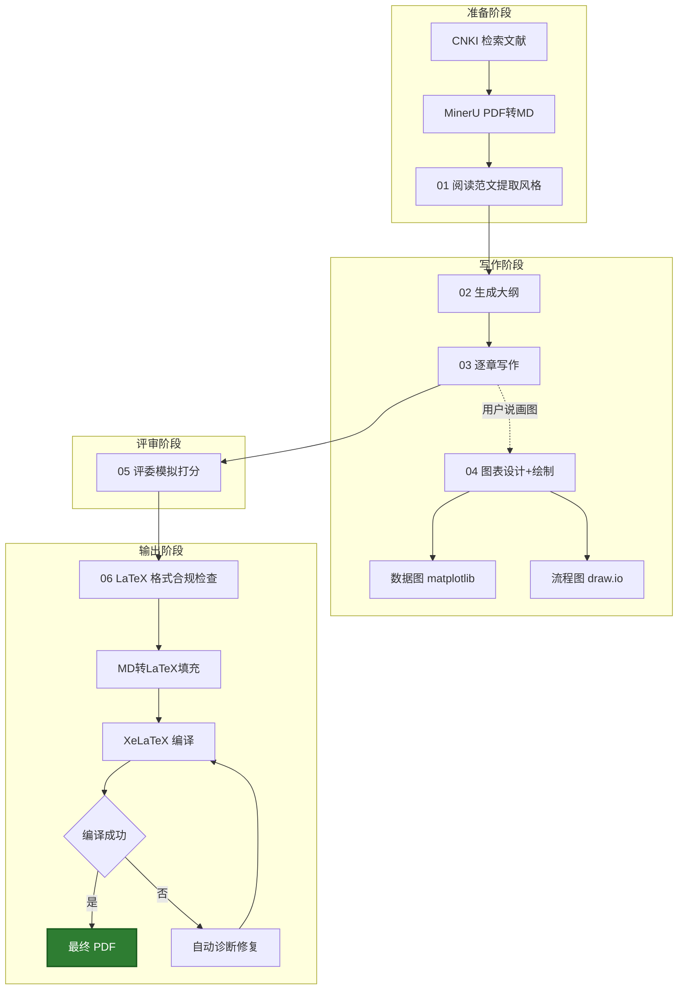

# 🎓 MCM Writer Agent（CN）

> **全自动写作工作台**  
> 为中国大学生数学建模竞赛（CUMCM）打造的 AI 写作智能体  
> 6 大 Skill · MinerU PDF 识别 · draw.io 流程图 · matplotlib 3D 绘图 · CNKI 知网集成 · LaTeX 自动排版 · 去 AI 味防护

<p align="center">
  
  
  
  
</p>

---

## Agent定位

**MCM Writer Agent (CN)** 是一套完全基于 VS Code + Markdown 的工程化数模写作辅助系统。

-  **总控 Agent 驱动**：由一个总控智能体统一调度 6 个子 Skill，用户只需一句口语化指令即可触发全流程
-  **中文原生**：所有文件夹、Skill 名、指令均为中文，零学习成本
-  **数据安全**：建模结果只读不可改，杜绝 AI 幻觉篡改数据
-  **端到端输出**：从文献检索 → 大纲规划 → 分章节写作 → 图表设计+绘制 → 评委模拟 → LaTeX 排版 → 最终 PDF，全链路覆盖

---

## 功能总览


| 能力 | 说明 |
|------|------|
| 文献检索 | CNKI 知网摘要检索 + GB/T 7714 引用格式自动生成 |
| 范文识别 | MinerU 本地高精度识别往届数模优秀论文 PDF→MD（公式/表格/图片） |
| 大纲规划 | 结合范文模板 + 建模思路，自动生成论文骨架 |
| 分章写作 | 严格依据建模数据，LaTeX 公式 + 学术风格 |
| 图表设计与绘制 | 设计+绘制双模式：matplotlib 数据图（含 3D）+ draw.io 逻辑流程图；自动生成图表 PNG 与 .drawio 文件 |
| 论文评审 | 双模式：格式质检 + 国赛评委模拟打分 |
| LaTeX 排版 | 模板填充 → 格式合规检查 → XeLaTeX 编译 → 自动修复 |
| 🛡️ 去 AI 味防护 | 写作规范（禁用词表+标点约束+句式多样性+数值推理）+ 评审检测（7项自动扫描+人工抽查）；范文驱动的语言指纹复现，不制造语病 |

---

## 6 大 Skill 详解

### 01-文献阅读与整理 

| 项目 | 说明 |
|------|------|
| **触发词** | "学习范文"、"提取风格"、"识别PDF"、"PDF转MD" |
| **输入** | 范文存档（A/B/C 题 Markdown）或 PDF 论文 |
| **输出** | 范文模板更新 + 索引清单 / PDF→Markdown 识别结果 |
| **核心能力** | ① 提取论文题目、摘要关键词、架构逻辑、高频动词、图表风格、专业句式 ② MinerU PDF 高精度识别（公式→LaTeX、表格→HTML、图片分析） |

### 02-论文大纲规划 

| 项目 | 说明 |
|------|------|
| **触发词** | "生成大纲"、"规划结构" |
| **输入** | 建模思路文档 + 范文模板 |
| **输出** | `论文大纲_草稿.md`（含图表文字设计方案） |
| **核心能力** | 自动规划章节编号、子标题、预计篇幅，每张图表均附带完整文字设计方案（名称/类型/维度/内容/绘制工具） |

### 03-论文写作 

| 项目 | 说明 |
|------|------|
| **触发词** | "写第X问"、"撰写XX部分" |
| **输入** | 建模文档 + 编程计算结果 + 范文模板 |
| **输出** | `分章节/` 下的 Markdown 草稿 |
| **核心能力** | 数据严格来自编程结果（不编造），公式 LaTeX 语法，变量符号与建模一致；已有图表直插 MD，缺失图表用【图表占位】标注；内置去 AI 味写作规范（6 条子规则），全程控制 AI 检测率 |

### 04-图表设计与绘制 

| 项目 | 说明 |
|------|------|
| **触发词（设计）** | "配什么图"、"设计图表" |
| **触发词（绘制）** | "画图"、"画3D图"、"画流程图"、"出图" |
| **输入** | 建模文档 + 运行结果 + 配色模板 + 图表设计方案 |
| **输出** | 设计模式→`图X-Y_设计方案.md`；绘制模式→数据图 `.png` / 流程图 `.drawio` |
| **核心能力** | 双模式：① 设计模式输出文字方案（名称/类型/维度/配色/数据来源/设计说明）② 绘制模式——数据图用 Python matplotlib（含 3D projection='3d'，中文标注，紧凑布局，DPI≥300），逻辑流程图用 draw.io（生成 .drawio 文件，VS Code 双击编辑） |

### 05-论文评审 

| 项目 | 说明 |
|------|------|
| **触发词** | "检查初稿"、"模拟评委打分" |
| **输入** | 论文草稿 + 国赛评分细则 + 历史评审意见 |
| **输出** | 格式质检报告 + 评委模拟评分 |
| **核心能力** | 三模式：格式质检（公式/图表编号连续性）+ AI 味专项检测（7 项自动扫描+人工抽查）+ 评委模式（预估国赛名次 + 改进方向） |

### 06-LaTeX 模板填充与排版 

| 项目 | 说明 |
|------|------|
| **触发词** | "填充LaTeX"、"生成PDF"、"修复LaTeX语法" |
| **输入** | LaTeX 模板（.cls）+ 论文草稿章节 + 格式要求 |
| **输出** | 编译后的 PDF + 格式检查报告 |
| **核心能力** | 三模式：A-填充（MD→LaTeX 转换 + 编译 + 自动修复） / B-检查（格式合规审查） / C-修复（.log 诊断 11 种常见错误） |

**工作流程**：
```
论文草稿 → 读取 LaTeX 模板 → 格式合规检查（12项）
→ MD→LaTeX 章节映射转换 → XeLaTeX 编译
→ 编译失败？→ 自动读取 .log → 诊断修复（最多3轮）→ 重新编译
→ 输出 PDF
```

---

## 环境配置

>  **Agent 自动配置**：启动后 Agent 会自动检测缺失的组件，并通过 `winget` / `pip` 命令行一键安装，无需手动下载。你只需说"配置环境"即可。

### 自动配置项

| 组件 | Agent 自动安装命令 |
|------|-------------------|
| Python 包（matplotlib/Pillow） | `pip install ...` |
| draw.io VS Code 扩展 | `code --install-extension hediet.vscode-drawio` |
| TeX Live（XeLaTeX） | `winget install TeXLive.TeXLive --silent` |
| MinerU（PDF→MD） | `git clone` + `pip install -e .`（Agent 自动引导配置） |

### 需手动安装

| 组件 | 用途 | 说明 |
|------|------|------|
| **VS Code** | 主编辑器 | 一次性安装 |

### LaTeX 中文字体（CUMCM 官方模板要求）

- **SimSun**（宋体）- 正文
- **SimHei**（黑体）- 标题
- **SimKai**（楷体）- 摘要

Windows 系统自带以上字体，无需额外安装。

---

## 快速开始

### 1. 克隆项目

```bash
git clone <your-repo-url>
cd "MCM agent"
```

### 2. 在 VS Code 中打开，让 Agent 自动配置环境

用 VS Code 打开项目根目录，总控 Agent 自动加载并执行环境自检，缺失组件会通过命令行自动安装。

### 3. 放入你自己的资料（手动）

Agent 提供写作流水线，但以下内容需要你**自行放入对应文件夹**：

| 你需要放的 | 放到哪里 | 说明 |
|-----------|---------|------|
|  范文 PDF | 对 Agent 说"识别PDF" → 自动输出到 `知识库/文献库/范文存档/{A,B,C}题/` | 供 01-Skill 学习风格 |
|  赛题原文 | `赛题01/赛题原文/问题陈述.md` | 供 03-Skill 每次写作前读取 |
|  格式规范 | `赛题01/赛题原文/格式要求.md` | 供 06-Skill 格式合规检查 |
| 📊建模思路 & 计算结果 | `赛题01/建模思路/`、`编程计算结果/` | Agent 只读，绝不篡改 |

### 4. 说一句话开始

在 VS Code Copilot Chat 中输入以下任意指令即可启动：

| 你想做什么 | 直接说 |
|-----------|--------|
| 学习优秀范文 |  "学习范文风格" |
| PDF 论文转 Markdown |  "识别PDF"、"PDF转MD" |
| 规划论文结构 |  "生成大纲" |
| 写正文 |  "写第一问的模型建立" |
| 设计图表 |  "设计图表"、"配什么图" |
| 画图 |  "画图"、"画3D图"、"画流程图"、"出图" |
| 一键成稿 |  "写全文" |
| 检查论文（含 AI 味检测） |  "检查初稿" |
| 生成 PDF | "生成PDF" |
| 修复 LaTeX 报错 |  "修复LaTeX语法" |

---

## 完整工作流



---

## PDF 转 Markdown 指南

### 为什么用 Markdown？

本项目全部使用 `.md` 格式而非 PDF，原因有二：

1. **节省 Token** — MD 纯文本比 PDF 页面描述小几十倍，大幅降低 AI 调用成本
2. **提升准确度** — 纯文本无 OCR 噪音，Agent 直接阅读结构化内容，不会误读

### 推荐方案：MinerU（已集成到 Agent）⭐

[MinerU](https://github.com/opendatalab/MinerU) 是 OpenDataLab 开源的高精度 PDF 提取工具。Agent 已完整集成，只需一句指令即可完成识别。

**Agent 自动完成的工作**：
1. 检测 GPU → 自动选择 `pipeline`（CPU）或 `hybrid-engine`（GPU 高精度）
2. 执行识别（公式→LaTeX、表格→HTML、图片分析）
3. 整理输出：仅保留 Markdown 到 `知识库/文献库/范文存档/{A,B,C}题/`
4. 清理临时中间文件

**一句话触发**：
```
 "帮我识别这篇 PDF"
"PDF转MD"
"识别论文PDF"
```

**首次使用需部署 MinerU**（Agent 会引导完成）：
```bash
git clone https://github.com/opendatalab/MinerU.git F:\MinerU
cd F:\MinerU
python -m venv venv
.\venv\Scripts\activate
pip install -e .
mineru --download-models
```

**识别的功能特性**：

| 功能 | 支持情况 | 说明 |
|------|---------|------|
| 公式识别 |  LaTeX 格式 | 行内公式 + 块级公式 |
| 表格识别 |  HTML 格式 | 保留表格结构 |
| 图片/图表分析 |  GPU 模式下 | 需要 NVIDIA GPU 8GB+ 显存 |
| 多语言 OCR |  109 种语言 | 中英文混合文档 |
| 页眉页脚 |  自动移除 | 仅保留正文内容 |

**两种精度模式**：

| 模式 | 命令 | 适用场景 |
|------|------|---------|
| `pipeline`（默认） | `mineru -p <PDF> -o <输出> -b pipeline -l ch -m auto` | CPU / 低显存，公式+表格 |
| `hybrid-engine`（高精度） | `mineru -p <PDF> -o <输出> -b hybrid-engine -l ch --effort high` | NVIDIA GPU 8GB+，含图片分析 |

> 💡 Agent 会自动检测硬件并选择最优模式，无需手动指定。

### 备选方案二：多模态 AI 网页工具（免费）

如果不想折腾本地部署，可以把 PDF 上传到支持多模态的 AI 网页（如 ChatGPT、Claude、Kimi 等），让它直接输出 Markdown 文本，复制粘贴保存为 `.md` 即可。

- 免费、零配置
- 需要手动逐篇操作，公式可能失真

---

## CNKI 知网集成

项目内置 CNKI MCP 工具链，用于**文献摘要检索**和**GB/T 7714 引用格式生成**：

| 能力 | 说明 |
|------|------|
| 摘要检索 | 按关键词搜索中文论文，获取标题、作者、摘要、期刊信息 |
| 引用格式生成 | 自动输出 GB/T 7714 标准引用格式，直接用于论文参考文献 |
| 文献真实性验证 | 验证用户提供的引用是否在 CNKI 数据库中真实存在 |

> CNKI 工具不涉及 PDF 全文下载和全文识别。往届数模竞赛优秀论文的 PDF 识别由 MinerU（01-Skill 内置）负责。

---

## 目录结构

```text
MCM_Agent_CN/
├── .github/agents/               # 总控 Agent 定义
├── 知识库/
│   ├── 文献库/                   # 范文存档 + 索引
│   ├── 模板与规范/               # 评分细则 + 范文模板
│   │   └── 图标模板/             # 图表配色与撞色设计
│   └── 评委记忆/                 # 历史评审意见
├── 技能核心库/                   # 6 个 Skill 定义文件
│   ├── 01-文献阅读与整理 SKILL.md
│   ├── 02-论文大纲规划 SKILL.md
│   ├── 03-论文写作 SKILL.md
│   ├── 04-图表设计 SKILL.md
│   ├── 05-论文评审 SKILL.md
│   └── 06-LaTeX 模板填充与排版 SKILL.md 🆕
└── 赛题01/                       # 每道题独立隔离
    ├── 进度日志.md
    ├── 赛题原文/
    │   ├── 问题陈述.md
    │   └── 格式要求.md           # CUMCM 官方格式规范（11项）
    ├── 建模思路/
    ├── 编程计算结果/
    ├── 论文草稿/
    │   ├── 分章节/
    │   └── 图表/
    └── LaTeX正文/ 🆕
        ├── LaTeX目录说明.md      # 中文文件说明
        ├── *.tex                  # LaTeX 源文件
        ├── *.cls                  # 模板格式文件
        └── figures/               # 图表素材
```

---

## 常见问题

<details>
<summary><b>Q: 如何开始一个新赛题？</b></summary>

手动创建 `赛题02/`（复制 `赛题01/` 结构），将赛题原文放入 `赛题原文/`，然后对 Agent 说 "开启新赛题02" 即可。
</details>

<details>
<summary><b>Q: LaTeX 编译失败怎么办？</b></summary>

说 "修复LaTeX语法"，06-Skill 会自动读取 `.log` 文件，诊断 11 种常见错误并逐一修复。模板要求必须使用 **XeLaTeX** 编译器。
</details>

<details>
<summary><b>Q: 论文 AI 味太重 / 查重率过高怎么办？</b></summary>

Agent 内置了完整的「去 AI 味」三层防护体系：

1. **写作规范**（03-Skill）：禁用词替换表（10组AI高频词）、标点符号约束（引号/破折号上限）、句式多样性规则（句长节奏+段首变化）、数值推理规范（禁止"数值→模糊结论"跳跃）
2. **范文对齐**：写作后量化对比范文的"语言指纹"（连接词密度、句长方差、标点使用率），偏离则重写
3. **专项检测**（05-Skill）：评审时自动扫描 7 项 AI 味指标（逻辑连接词密度、破折号密度、术语引号密度、对称句式、虚词冗余、的字符密度、句长均匀度），标记可疑段落

> 💡 核心原则：让论文"更像人写的"而非"更差"。所有规则都不制造语病，不刻意写错。
</details>

<details>
<summary><b>Q: 如何确保 AI 不编造数据？</b></summary>

03-论文写作 Skill 被严格约束：所有表格数据必须来自`编程计算结果/`，公式变量符号必须与建模文档一致。Agent 对建模结果目录只有**只读**权限。
</details>

<details>
<summary><b>Q: CNKI 工具能下载论文全文吗？</b></summary>

CNKI 工具**仅用于摘要检索和 GB/T 7714 引用格式生成**，不涉及 PDF 全文下载。如需识别往届数模优秀论文 PDF，请使用 01-Skill 内置的 MinerU 功能（说"识别PDF"即可）。
</details>

<details>
<summary><b>Q: draw.io 流程图怎么用？</b></summary>

Agent 自动安装 `hediet.vscode-drawio` 扩展并生成 `.drawio` 文件到 `论文草稿/图表/`。双击文件即可在 VS Code 中用 draw.io 图形化编辑器打开，可手动微调布局、颜色和连线。流程图配色已预设学术风格。
</details>

<details>
<summary><b>Q: 格式要求有哪些？</b></summary>

完整的 CUMCM 官方格式规范见 `赛题01/赛题原文/格式要求.md`，包含 11 项规范：A4 纸、页边距 25mm、行距 1.38 倍、正文宋体 12pt、标题黑体、摘要楷体、三线表、编号规范等。06-LaTeX Skill 的格式合规检查以此文件为基准。
</details>

<details>
<summary><b>Q: 如何在 PDF 和源码之间快速跳转？（SyncTeX）</b></summary>

项目已配置 SyncTeX 正反向搜索，点击即可跳转：

| 操作 | 快捷键/方式 | 说明 |
|------|-----------|------|
| **源码 → PDF** | `Ctrl+Alt+J` | 光标在 `.tex` 源码某处，跳转到 PDF 对应位置 |
| **PDF → 源码** | `Ctrl + 鼠标左键` 点击 PDF 中文字 | 在 PDF 预览器中，直接跳回 `.tex` 源码对应行 |

> 💡 也可在 PDF 预览器中右键 → "SyncTeX from cursor" 实现反向跳转。
</details>

<details>
<summary><b>Q: LaTeX Workshop 编译按钮在哪里？</b></summary>

打开 `.tex` 文件后：
- **左侧工具栏**：点击 TeX 图标 → "Build LaTeX project"
- **快捷键**：`Ctrl+Alt+B`
- **配方选择**：首次编译会弹出配方列表，选 **"xelatex ×2（解决交叉引用）"** 后点编译按钮即可
- 配方已保存在 `.vscode/settings.json`，后续自动使用上次选择
</details>

---

## 版本历史

| 版本 | 日期 | 变更 |
|------|------|------|
| V1.0 | 2026-07-15 | 初始架构：5 Skill + 总控 Agent + 知识库 |
| V1.3 | 2026-07-18 | CNKI MCP 集成 + 进度日志 + 赛题隔离 |
| V1.4 | 2026-07 | 🆕 06-LaTeX 模板填充与排版 Skill + CUMCM 格式规范 + 格式合规自动检查 |
| **V1.5** | **2026-07-20** | 🆕 MinerU PDF→MD 识别集成到 01-Skill + 总控环境自检 + pipeline/hybrid-engine 双模式 |
| **V1.6** | **2026-07-20** | 🆕 04-Skill 升级为「设计+绘制」双模式：数据图用 matplotlib（含 3D）+ 流程图用 draw.io；03-Skill 图表处理改为查已有/加占位；移除 diagram_utils 流程图依赖；新增 draw.io VS Code 扩展 |
| **V1.7** | **2026-07-21** | 🛡️ 去 AI 味三层防护体系：03-Skill 新增「去 AI 味写作规范」（6 条子规则）+ 05-Skill 新增「AI 味专项检测」（7项扫描）+ Agent 新增「去 AI 味全局策略」；全文 14 项修复（目录重命名/文件名统一/路由表修正/编号一致性）；README 功能表合并精简 |

---

<p align="center">
  <sub>Made with ❤️ for CUMCM participants</sub>
</p>
